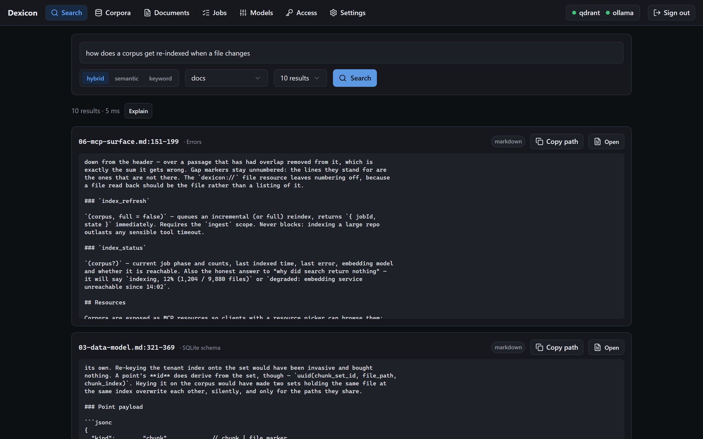

# Dexicon

**Semantic search over your own files, for coding agents. One container, on your machine.**

[](CHANGELOG.md)
[](LICENSE)
[](https://github.com/Merp4/dexicon/actions/workflows/ci.yml)

Point it at a folder. It indexes source trees, PDFs, EPUBs, Word and Markdown, and
answers questions about them over [MCP](https://modelcontextprotocol.io), so Claude Code
and other MCP clients can search your files.

```
search_index("how does promotion work")      → 04-ingestion.md:228-265, and nine more
get_context("docs", "04-ingestion.md", 246)  → the passage around it, with line numbers
```

Nothing leaves your machine by default: the embedder is a local Ollama and the index is a
local Qdrant. Hosted embedding providers are opt-in.



---

## Quickstart

Sixty seconds, assuming Docker.

```bash
git clone https://github.com/Merp4/dexicon.git && cd dexicon
cp .env.example .env
docker compose up -d
```

The first start pulls an embedding model, a few hundred MB. The bootstrap token is printed
once:

```bash
docker compose logs dexicon | grep bootstrap
```

Open <http://127.0.0.1:8477>, paste the token, and point a corpus at something under
`./workspaces`, which is mounted **read-only**.

To connect an agent, issue a token under **Access**:

```bash
claude mcp add --transport http dexicon http://localhost:8477/mcp \
  --header "Authorization: Bearer dex_…"
```

[docs/12](docs/12-clients.md) covers Cursor, VS Code, Windsurf, Cline, Claude Desktop and
Zed. `./scripts/install-mcp.ps1` writes any of those configs for you.

## What it does

- **Hybrid retrieval.** Dense and sparse in one Qdrant query with server-side fusion. If
  embeddings are unavailable it falls back to keyword and says so in the response.
- **Documents, not just code.** PDF, EPUB, DOCX, PPTX and HTML keep their natural unit, so
  results cite `#page=201` or `#chapter=8` rather than a line number into extracted text.
- **Chunk sets.** One corpus, several chunkings, addressed as `corpus:set`. Changing the
  embedding model is add-set, backfill, promote, so search never sees a half-built index.
- **Incremental refresh.** Content-hashed. A chunker or extractor change bumps a version
  and re-does only the work that invalidated.
- **Multi-tenant.** Tokens, scopes and per-corpus visibility, enforced at three layers.
- **Reports its own state.** A partial index, a skipped file and an empty corpus are each
  distinguishable from "no results".

## Status

Working, and young. The current release is [`0.2.1`](CHANGELOG.md), published as
`ghcr.io/merp4/dexicon`.

The defaults are [measured](docs/benchmarks.md) — 81 retrieval configurations over a
document corpus and again over a code corpus — though both corpora are this repository's
own. [The roadmap](docs/11-roadmap.md) lists what is outstanding.

## How it fits together

```
┌─ your machine ────────────────────────────────────────────────┐
│                                                               │
│   Claude Code ──MCP/HTTP──┐                                   │
│   Other agents ───────────┤                                   │
│   Browser ─────HTTP───────┤                                   │
│                           ▼                                   │
│                     ┌───────────┐   ┌──────────┐              │
│                     │  dexicon  │──▶│  qdrant  │              │
│                     │ UI+API+MCP│   └──────────┘              │
│                     │ + indexer │   ┌──────────┐              │
│                     └─────┬─────┘──▶│  ollama  │              │
│                           │         └──────────┘              │
│                    /workspaces (ro)                           │
└───────────────────────────────────────────────────────────────┘
```

One container for the UI, API, MCP server and indexer; Qdrant and Ollama alongside it.
[02](docs/02-architecture.md) covers why it is one process.

## Documentation

[01 — Overview](docs/01-overview.md) for scope and non-goals;
[12 — Connecting an agent](docs/12-clients.md) to wire it up.

| Doc | What it covers |
|---|---|
| [01 — Overview](docs/01-overview.md) | Problem, scope, explicit non-goals, who it is for |
| [02 — Architecture](docs/02-architecture.md) | Container topology, processes, request and data flows |
| [03 — Data model](docs/03-data-model.md) | Qdrant collections and payloads, SQLite catalogue, identifiers |
| [04 — Ingestion](docs/04-ingestion.md) | Sources, extraction, chunking, embedding, incremental reindex |
| [05 — Search](docs/05-search.md) | Hybrid dense + sparse retrieval, fusion, result contract |
| [06 — MCP surface](docs/06-mcp-surface.md) | Protocol, transport, the tools, `dexicon://` resources, wire examples |
| [07 — Tenancy & auth](docs/07-tenancy-auth.md) | Tenant header, tokens, corpus visibility, enforcement |
| [08 — UI](docs/08-ui.md) | Screens, interactions, live progress |
| [09 — Deployment](docs/09-deployment.md) | Compose topology, configuration, volumes, GPU, healthchecks |
| [10 — Security & secrets](docs/10-security-secrets.md) | Secret handling, container hardening, CI, licence review |
| [11 — Roadmap](docs/11-roadmap.md) | Milestones M0–M5, with definitions of done |
| [12 — Connecting an agent](docs/12-clients.md) | Per-client MCP setup |
| [Decisions](docs/decisions.md) | Every load-bearing choice, its rationale, and what was rejected |
| [Benchmarks](docs/benchmarks.md) | 81 retrieval configurations per corpus, and which defaults that earns |
| [Troubleshooting](docs/troubleshooting.md) | The failures that actually happen in the first hour |
| [Changelog](CHANGELOG.md) | What changed per release, and what an upgrade needs |

## Contributing

[CONTRIBUTING.md](CONTRIBUTING.md) covers getting it running and what a good change looks
like. Security problems go through [SECURITY.md](SECURITY.md), not the issue tracker.

## Licence

[Apache-2.0](LICENSE). Copyright 2026 Martyn Mcvay. Chosen for the express patent grant
and the trademark clause; see [D-14](docs/decisions.md#d-14-licence).

Every dependency is permissively licensed across the whole transitive tree —
[the review](docs/10-security-secrets.md#licence-review-of-the-dependency-tree), and
`scripts/licence-review.py` to re-run it.
